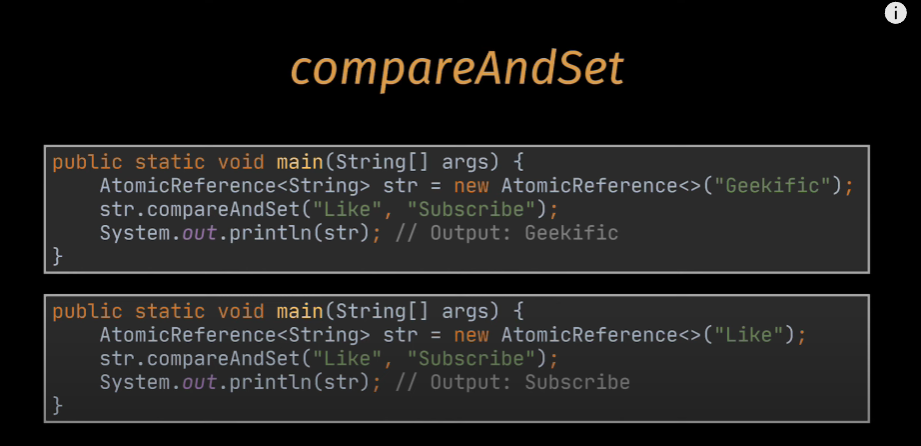

Threading allows a program to run multiple tasks simultaneously, Helps improve performance with time-consuming operations e.g.: File I/O, network communications, or any background tasks.

We can apply threads in two ways :-
1. Extends the Threads class (simpler)
2. Implements the Runnable interface (better)

Volitile variable ensures visibility, and this are never cached and are read directly from main method

Synchronized keywords includes both mutual exclusion and visibility it ensures only one and only one thread is allowed to enter this block of code at the same time.

eg.: public synchronized void count(){... }
M-2: public void count(){ synchronized (lock){... }}

TO wrap both read and write, this will be done directly from and to the main memory at a given time and both mutual exclusion and visibility will be ensured

Atomicity : the smallest ops that can be done, ops that is performed entirely or not executed at all.
i++ ==>> retrieve i -> increment i -> update i

e.g: public class Customer{
    private AtomicInteger idCounter = new AtomicInteger(0);
    private int id;
    public Customer(){
        id = idCounter.getAndIncrement(); --> return 0 and increments to 1
                        IncrementAndGet(); --> increment to 1 and returns 1
    } 
}

AtomicRefernce --> Object

get -> retreives the value from the memory
set -> Writes the value from the memory 

comapreAndSet method :-

